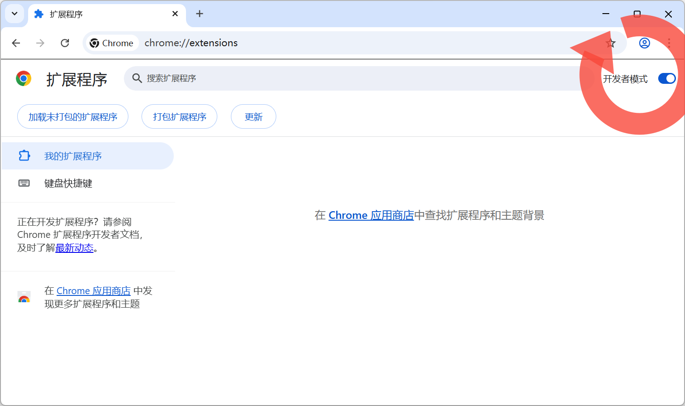
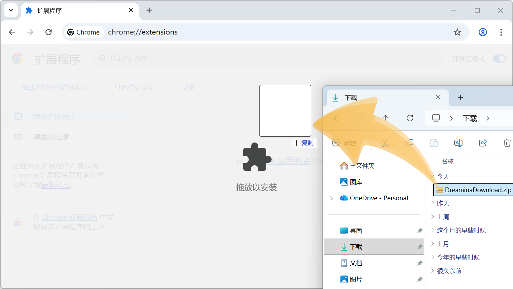
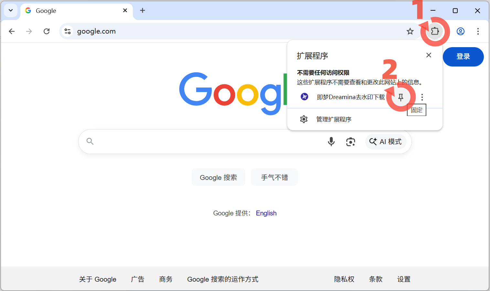

# 即梦 / Dreamina 去水印下载

Chrome / Edge 浏览器扩展，一键下载即梦和 Dreamina 平台的无水印图片与视频。

> 需要更多平台支持？访问 [zhizix.com](https://zhizix.com) 获取 B站、抖音、小红书、快手等多平台解析工具。

---

## 免责声明

**本工具仅供学习和研究使用，请勿用于商业用途。**

- 本扩展仅解析页面中已公开的资源链接，不涉及任何破解或非法访问行为
- 下载内容的版权归原作者所有，禁止用于商业用途或二次传播
- 用户应遵守即梦和 Dreamina 平台的服务条款
- 因使用本工具产生的任何法律纠纷与开发者无关

---

## 预览图


---
## 功能

- **去水印下载** — 自动获取无水印的高清原图和原画视频
- **双模式解析** — 快速去水印下载 + 原画解析下载（即梦主站详情页）
- **浮动下载按钮** — 详情页内直接显示下载入口，无需打开扩展弹窗
- **SPA 适配** — 完整支持即梦单页应用的路由切换和详情弹窗
- **多页面支持** — 即梦图片/视频详情页、Dreamina 图片/视频详情页、生成页

## 支持的页面

| 平台 | 类型 | 解析能力 |
|------|------|---------|
| 即梦主站 | 图片详情页 | 快速下载（SPA 画质） + 原画解析（弹tab获取原图） |
| 即梦主站 | 视频详情页 | 快速下载（标准画质） + 原画解析（弹tab获取原画） |
| 即梦主站 | 生成页 | 标准画质 |
| Dreamina | 图片详情页 | 原图下载 |
| Dreamina | 视频详情页 | 原画视频下载 |
| Dreamina | 生成页 | 标准画质 |

## 安装

### Chrome 商店

上架审核中。

### Edge 商店

上架审核中。

### 手动添加方法（ZIP），适用于所有浏览器

> **如果你无法访问扩展商店，可以下载 ZIP 压缩包，按下面 4 步手动安装。**

[点击下载 ZIP 浏览器扩展压缩包](https://github.com/zhiziX/DreaminaDownload/releases/download/jimeng/DreaminaDownload-latest.zip)

> 第1步：打开浏览器扩展管理页面


> 第2步：打开【开发者模式】按钮



> 第3步：将下载好的压缩包，拖进浏览器扩展管理页面



> 第4步：打开扩展程序按钮，将扩展固定在工具栏



## 使用

1. 打开即梦或 Dreamina 的作品详情页
2. 页面上会自动出现浮动下载按钮，点击即可下载
3. 也可以点击浏览器工具栏的扩展图标，查看解析结果并下载
4. 即梦主站详情页提供两个按钮：
   - **快速去水印下载** — 直接下载当前页面解析到的资源
   - **原画解析下载** — 自动弹出标签页获取原始画质资源，完成后自动关闭

## 项目结构

```
├── manifest.json        # 扩展配置
├── background.js        # Service Worker，处理下载和弹tab解析
├── content.js           # 内容脚本，解析页面媒体资源
├── page-bridge.js       # 页面主世界脚本，捕获 SPA 路由数据
├── popup.html / popup.js # 扩展弹窗界面
├── rules/referer.json   # 声明式网络请求规则（Referer 头）
└── icons/               # 扩展图标
```

## 权限说明

| 权限 | 用途 |
|------|------|
| `activeTab` | 读取当前标签页内容以解析媒体资源 |
| `downloads` | 触发浏览器下载 |
| `storage` | 保存扩展设置（仅本地） |
| `declarativeNetRequestWithHostAccess` | 设置下载请求的 Referer 头 |
| `host_permissions` | 访问即梦和 Dreamina 平台页面 |

## 开源协议

[MIT License](LICENSE)

## 联系

- 项目主页：[GitHub](https://github.com/zhiziX/DreaminaDownload)
- 问题反馈：[Issues](https://github.com/zhiziX/DreaminaDownload/issues)
- 更多工具：[zhizix.com](https://zhizix.com)
